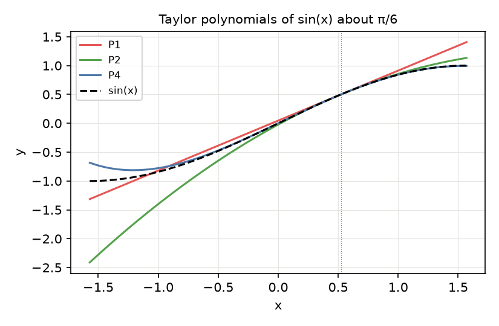
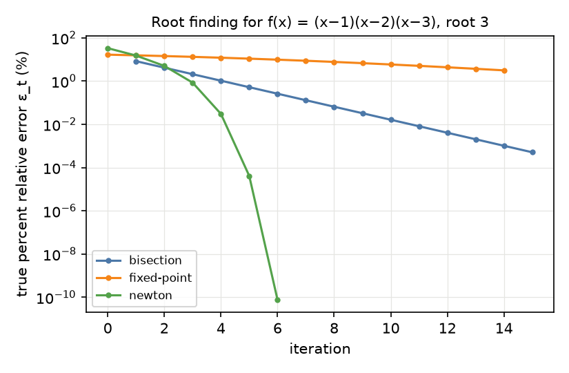
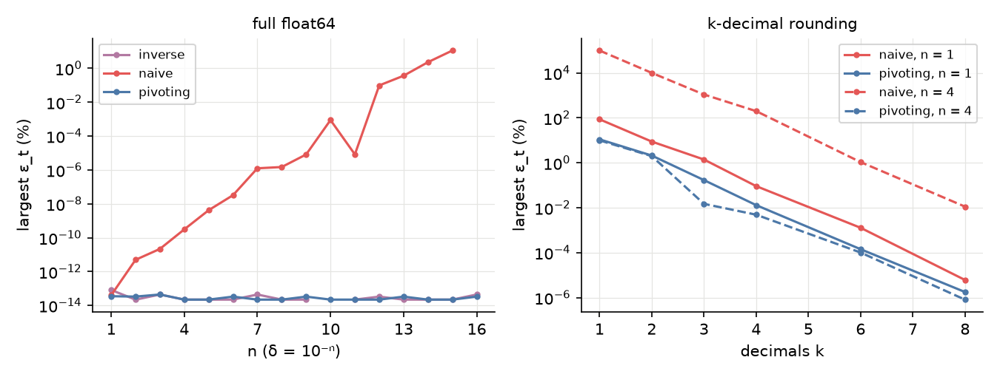
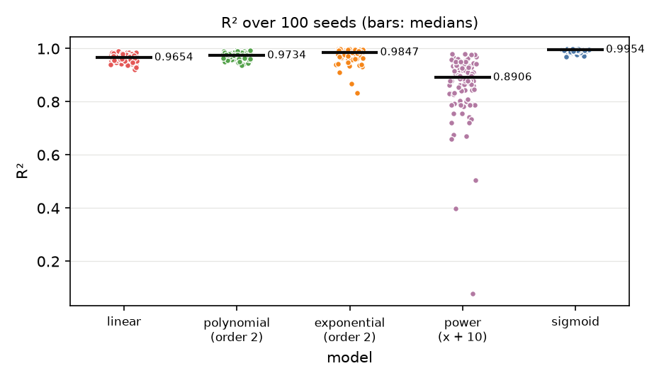

# 수치해석 기법의 구현과 오차 분석

**기간**

- E1–E2: 2024.03.25 – 2024.04.14
- E3–E4: 2024.05.02 – 2024.05.26

## 개요

Taylor 급수, 근 찾기, 선형 연립방정식, 회귀의 고전 수치해석 기법을 SciPy 없이
NumPy로 직접 구현하고, 각 기법의 오차를 측정한다. E3의 역행렬 풀이,
E4의 정규방정식 풀이, 조건수·고유값 계산에는 `numpy.linalg`를 사용한다. 네 실험은 서로 독립적이다. 모든
실행의 설정, 전체 결과 표, 관찰은 [`docs/experiment-log.md`](docs/experiment-log.md)(이하
로그)에 기록한다.

## 실험 구성

| 실험 | 주제 | 설정 |
| --- | --- | --- |
| E1 | Taylor 급수 | `sin(x)`를 `π/6`에서 전개, `x = π/6 + 0.005`에서 차수 0–10 |
| E2 | 근 찾기 | `f(x) = (x−1)(x−2)(x−3)`의 근 3, 이분법·고정점 반복·Newton-Raphson, 방법별 15개 기록(이분법은 15회 반복, 나머지는 시작값 `x0`와 14회 반복) |
| E3 | 선형 연립방정식 | 대각이 `δ = 10⁻ⁿ`(`n = 1–16`)인 4×4 행렬, 풀이법 5종과 소수점 아래 `k`자리 반올림 |
| E4 | 분포 회귀 | 정규분포 표본 100개의 경험적 CDF를 모델 5종으로 적합, seed 100개 |

- **오차:** 참 백분율 상대오차 `ε_t = |(참값 − 근삿값) / 참값| · 100`(%), 근사 백분율
  상대오차 `ε_a = |(현재 − 이전) / 현재| · 100`(%).
- **표기:** 측정값은 유효숫자 4자리로 표기하며, `0`은 float64에서 정확히 0이다.

## 결과

### E1: Taylor 급수

| 차수 n | 0 | 1 | 2 | 3 | 4 | 5 | 6–10 |
| --- | --- | --- | --- | --- | --- | --- | --- |
| `ε_t` (%) | 0.8574 | 0.001243 | 3.575e-06 | 2.586e-09 | 4.469e-12 | 2.201e-14 | 0 |

  

*그림 1. `π/6`에서 전개한 `sin(x)`의 Taylor 다항식.*

### E2: 근 찾기

| 방법 | 시작 | 15번째 기록의 `ε_t` (%) |
| --- | --- | --- |
| 이분법 | 구간 [2.5, 4] | 0.0005086 |
| 고정점 반복 | `x0 = 2.5` | 3.134 |
| Newton-Raphson | `x0 = 4` | 0(iteration 7부터 `x = 3.0`) |

  

*그림 2. iteration별 참 백분율 상대오차(log scale). 오차가 0인 기록은 그리지 않았다.*

### E3: 선형 연립방정식

*참 백분율 상대오차 `ε_t`(%)의 네 성분 중 최댓값. 기준은 유리수 연산으로 구한 정확해이다.*

| n (δ = 10⁻ⁿ) | cond₂(A) | 단순 가우스 소거 | partial pivoting | Gauss-Seidel(이완 1, 0.9) |
| --- | --- | --- | --- | --- |
| 1 | 14.94 | 4.049e-14 | 3.522e-14 | nan |
| 4 | 13.42 | 3.110e-10 | 2.221e-14 | nan |
| 8 | 13.42 | 1.488e-06 | 2.220e-14 | nan |
| 12 | 13.42 | 0.09771 | 2.220e-14 | nan |
| 15 | 13.42 | 11.18 | 2.220e-14 | nan |
| 16 | 13.42 | nan | 3.331e-14 | nan |

  

*그림 3. `δ`에 따른 오차(좌)와 소수점 아래 `k`자리 반올림에 따른 오차(우).*

- `δ`가 작아져도 행렬의 조건수는 13.42–14.94로 거의 변하지 않는다. 단순 가우스
  소거의 오차는 작은 pivot `δ`로 나누는 단계에서 커진다.
- Gauss-Seidel 반복 행렬의 spectral radius는 모든 `n`에서 1.091e+05(이완 1),
  6.830e+04(이완 0.9) 이상이며, 모든 실행이 1000 sweep 뒤 nan으로 끝났다.

### E4: 분포 회귀

*seed 100개(0–99)에서의 `R²`.*

| 모델 | `R²` 평균 ± 표준편차 | 중앙값 | `R²`가 가장 높은 seed 수 |
| --- | --- | --- | --- |
| 선형 | 0.9643 ± 0.01392 | 0.9654 | 0 / 100 |
| 2차 다항식 | 0.9724 ± 0.01162 | 0.9734 | 6 / 100 |
| 지수(2차) | 0.9774 ± 0.02529 | 0.9847 | 15 / 100 |
| 거듭제곱(`x + 10`) | 0.8609 ± 0.1239 | 0.8906 | 0 / 100 |
| **sigmoid** | **0.9934 ± 0.005766** | **0.9954** | **79 / 100** |

  

*그림 4. seed별 `R²`. 막대와 숫자는 중앙값이다.*

- seed 0 하나만 보면 지수 모델의 `R²`(0.9969)가 가장 높지만, seed 100개에서는
  sigmoid 모델이 79개에서 가장 높다.
